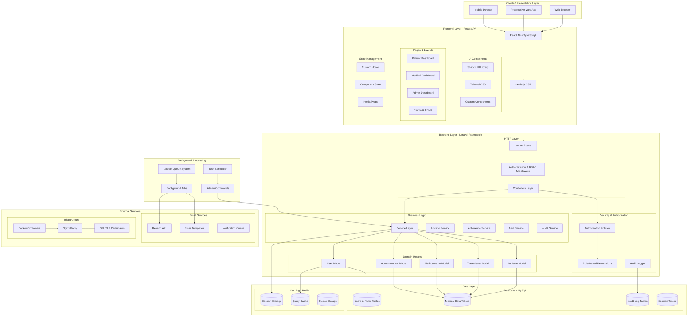

# Arquitectura de MediTrack

## Resumen Ejecutivo

MediTrack implementa una arquitectura de aplicación web moderna basada en el patrón MVC (Model-View-Controller) con separación clara de responsabilidades entre capas. La aplicación utiliza Laravel como framework backend y React como biblioteca frontend, conectados mediante Inertia.js para lograr una experiencia de aplicación de página única (SPA) con renderizado del lado del servidor (SSR).

## Diagrama de Arquitectura General



## Componentes por Capas

### 1. Capa de Presentación (Client Layer)

**Tecnologías:** React 19, TypeScript 5.7.2, Inertia.js 2.0

**Responsabilidades:**
- Renderizado de interfaces de usuario
- Gestión del estado local de componentes
- Validación de formularios del lado cliente
- Interacción directa con el usuario

**Componentes Principales:**

#### UI Framework
- **Shadcn UI**: Sistema de componentes base reutilizables
- **Tailwind CSS**: Framework de utilidades CSS para estilos
- **Custom Components**: Componentes específicos del dominio médico

#### Páginas Especializadas por Rol
- **Dashboard del Paciente**: Cronograma personal, métricas de adherencia
- **Dashboard Médico**: Vista de pacientes asignados, prescripciones
- **Dashboard Administrativo**: Métricas del sistema, gestión de usuarios
- **Formularios CRUD**: Interfaces para gestión de entidades

#### Gestión de Estado
- **React Hooks**: useAuth, useAppearance, useToast para funcionalidades específicas
- **Inertia Props**: Estado compartido entre servidor y cliente
- **Component State**: Estado local de componentes React

### 2. Capa de Aplicación (Backend Layer)

**Tecnologías:** Laravel 12, PHP 8.4, Composer

**Responsabilidades:**
- Procesamiento de lógica de negocio
- Autenticación y autorización
- Validación de datos del servidor
- Orquestación de servicios

**Componentes Principales:**

#### HTTP Layer
- **Laravel Router**: Enrutamiento RESTful con grupos de rutas por rol
- **Middleware Stack**: 
  - Authentication (verificación de sesión)
  - RBAC (control de acceso basado en roles)
  - CSRF Protection
  - Rate Limiting
- **Controllers**: 15+ controladores especializados por dominio

#### Service Layer (Lógica de Negocio)
- **HorarioService**: Generación automática de cronogramas de medicación
- **AdherenceService**: Cálculo de métricas de adherencia temporal
- **AlertService**: Sistema de alertas médicas y notificaciones
- **AuditService**: Registro de auditoría para trazabilidad

#### Domain Models (Eloquent ORM)
- **User Model**: Gestión de usuarios con roles múltiples
- **Paciente Model**: Entidad central con relaciones complejas
- **Tratamiento Model**: Gestión de tratamientos programados
- **Medicamento Model**: Catálogo farmacológico
- **Administracion Model**: Registro de tomas de medicamentos

#### Security & Authorization
- **Policy Classes**: Autorización granular por entidad
- **Role-Based Permissions**: Sistema RBAC con 5 roles
- **Audit Logger**: Registro automático de acciones críticas

### 3. Capa de Datos (Data Layer)

**Tecnologías:** MySQL 8.0, Redis, Eloquent ORM

**Responsabilidades:**
- Persistencia de datos
- Gestión de relaciones complejas
- Optimización de consultas
- Caching estratégico

**Componentes Principales:**

#### Base de Datos Principal (MySQL)
- **Users & Roles Tables**: Sistema de usuarios con roles y permisos
- **Medical Data Tables**: 25+ tablas para gestión médica
- **Audit Tables**: Registro completo de actividades
- **Session Tables**: Gestión de sesiones de usuario

#### Sistema de Cache (Redis)
- **Session Storage**: Almacenamiento de sesiones de usuario
- **Query Cache**: Cache de consultas frecuentes
- **Queue Storage**: Cola de trabajos en segundo plano

### 4. Servicios Externos (External Services)

#### Email Services
- **Resend API**: Servicio de email transaccional
- **Email Templates**: Templates personalizados por rol de usuario
- **Notification Queue**: Cola de notificaciones asíncronas

#### Infrastructure Services
- **Docker Containers**: Containerización para deployment
- **Nginx Proxy**: Servidor web y proxy reverso
- **SSL/TLS**: Certificados de seguridad

### 5. Procesamiento en Segundo Plano

**Tecnologías:** Laravel Queue, Artisan Commands

**Componentes:**
- **Queue System**: Procesamiento asíncrono de tareas
- **Background Jobs**: Jobs para emails, cálculos, limpieza
- **Task Scheduler**: Programación de tareas recurrentes
- **Artisan Commands**: Comandos CLI para mantenimiento

## Patrones de Arquitectura Implementados

### 1. Model-View-Controller (MVC)
- **Model**: Eloquent models con business logic
- **View**: React components con Inertia.js
- **Controller**: Laravel controllers para orchestration

### 2. Repository Pattern
- Abstracción de acceso a datos a través de Eloquent
- Interfaces consistentes para operaciones CRUD
- Facilita testing con mocks

### 3. Service Layer Pattern
- Encapsulación de lógica de negocio compleja
- Servicios reutilizables entre controllers
- Separación de responsabilidades

### 4. Observer Pattern
- AuditableObserver para logging automático
- Event-driven architecture para notificaciones
- Decoupling entre componentes

### 5. Policy Pattern
- Autorización granular por entidad
- Centralización de reglas de negocio
- Flexibilidad en permisos

## Flujo de Datos

### 1. Request Lifecycle
```
User Interaction → React Component → Inertia.js → Laravel Router → 
Middleware → Controller → Service → Model → Database
```

### 2. Response Flow
```
Database → Model → Service → Controller → Inertia Response → 
React Component → User Interface
```

### 3. Authentication Flow
```
Login Form → AuthController → User Model → Session Creation → 
Role Assignment → Permission Verification → Dashboard Redirect
```

### 4. Background Processing
```
User Action → Job Dispatch → Queue Processing → 
Email Service → Notification Delivery
```

## Escalabilidad y Performance

### Estrategias de Optimización
- **Query Optimization**: Eager loading, índices, query scoping
- **Caching Strategy**: Redis para sesiones y queries frecuentes
- **Asset Optimization**: Vite para bundling y minificación
- **Database Indexing**: Índices estratégicos en consultas frecuentes

### Monitoreo y Observabilidad
- **Application Logs**: Laravel logging con diferentes niveles
- **Audit Trail**: Registro completo de acciones de usuario
- **Performance Metrics**: Métricas de response time y throughput
- **Error Tracking**: Manejo centralizado de excepciones

## Seguridad

### Medidas Implementadas
- **Authentication**: Multi-factor authentication ready
- **Authorization**: Role-based access control (RBAC)
- **Data Protection**: Encryption at rest y in transit
- **Input Validation**: Server-side validation robusta
- **CSRF Protection**: Tokens CSRF en todas las requests
- **SQL Injection Prevention**: Eloquent ORM con prepared statements
- **XSS Protection**: Escape de output automático

### Compliance
- **Data Privacy**: Preparado para cumplimiento GDPR
- **Medical Data**: Manejo seguro de información médica sensible
- **Audit Requirements**: Trazabilidad completa de acciones

## Deployment y DevOps

### Containerización
- **Docker Compose**: Orquestación de servicios
- **Multi-stage Builds**: Optimización de imágenes
- **Environment Management**: Configuración por ambiente

### CI/CD Pipeline
- **Automated Testing**: 23 tests funcionales automatizados
- **Code Quality**: Linting y formatting automático
- **Deployment Scripts**: Scripts automatizados para production

Esta arquitectura proporciona una base sólida, escalable y mantenible para el crecimiento futuro de MediTrack, con separación clara de responsabilidades y patrones de diseño bien establecidos. 