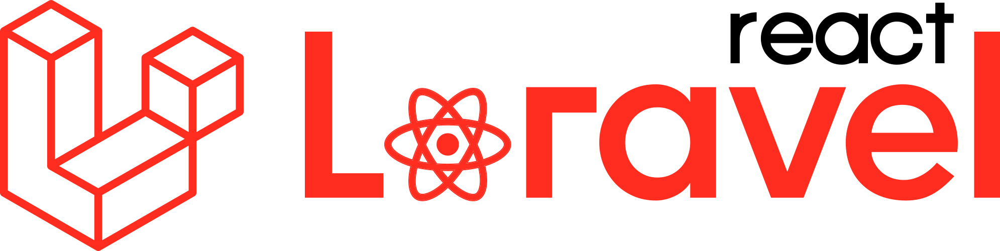

# 🏥 MediTrack

<div align="center">
  
  
  **Plataforma integral para el seguimiento y gestión de tratamientos médicos**
  
  [](https://laravel.com)
  [](https://reactjs.org)
  [](https://www.typescriptlang.org)
  [](https://mysql.com)
  [](https://docker.com)
  []()

  [🌐 Demo en Vivo](https://meditrack.correos.cl) • [📖 Documentación](./docs) • [🐛 Reportar Bug](https://github.com/pablomariano/medi-track/issues)
</div>

---

## 🎯 **¿Qué es MediTrack?**

MediTrack es una **plataforma web integral** diseñada para mejorar la adherencia al tratamiento médico mediante tecnología accesible y seguimiento colaborativo. Conecta a **pacientes, médicos, cuidadores y familias** en un ecosistema digital que facilita el cumplimiento de tratamientos médicos.

### 🔑 **Problema que Resuelve**
- **50% de pacientes** no siguen correctamente sus tratamientos
- **Falta de comunicación** entre el equipo médico y pacientes
- **Gestión manual ineficiente** de horarios de medicamentos
- **Ausencia de seguimiento** en tiempo real del cumplimiento

### 🚀 **Nuestra Solución**
Una plataforma moderna que digitaliza y automatiza el seguimiento de tratamientos, mejorando la adherencia del **50% al 80%** mediante:
- 📱 **Interfaz intuitiva** especialmente diseñada para adultos mayores
- ⏰ **Recordatorios automáticos** y notificaciones inteligentes
- 📊 **Métricas en tiempo real** de adherencia y progreso
- 👥 **Colaboración entre** médicos, cuidadores y familias

---

## ✨ **Características Principales**

### 👤 **Para Pacientes**
- 🏠 **Dashboard personalizado** con resumen de salud
- 💊 **Mi Cronograma** - Confirmación interactiva de dosis
- 📋 **Mis Medicamentos** - Catálogo personal con instrucciones
- 📈 **Seguimiento de adherencia** con métricas visuales
- 🔔 **Recordatorios automáticos** vía email

### 👨‍⚕️ **Para Médicos**
- 🏥 **Dashboard médico** con pacientes asignados
- 💉 **Prescripción digital** de tratamientos
- 📊 **Reportes de adherencia** detallados por paciente
- ⚠️ **Alertas médicas** de dosis omitidas e interacciones
- 📝 **Historial completo** de administraciones

### 👩‍⚕️ **Para Cuidadores**
- 📅 **Cronograma diario** de pacientes asignados
- ✅ **Registro rápido** de administraciones
- 📱 **Notificaciones** de tareas pendientes
- 📋 **Lista de medicamentos** por paciente
- 🤝 **Comunicación** con equipo médico

### 👨‍👩‍👧‍👦 **Para Familias/Apoderados**
- 👀 **Vista general** de pacientes bajo cuidado
- 📧 **Reportes automáticos** de adherencia
- 🚨 **Alertas importantes** de salud
- 📞 **Contacto directo** con cuidadores y médicos

### 🔐 **Para Administradores**
- 📊 **Analytics avanzados** del sistema
- 👥 **Gestión de usuarios** y asignaciones
- 🔍 **Auditoría completa** de actividades
- ⚙️ **Configuración** de parámetros del sistema

---

## 🏗️ **Arquitectura Técnica**

### **Stack Tecnológico**

| **Frontend** | **Backend** | **Base de Datos** | **DevOps** |
|--------------|-------------|-------------------|------------|
| React 19 | Laravel 12 | MySQL 8.0 | Docker |
| TypeScript | PHP 8.4 | Redis | GitHub Actions |
| Inertia.js | Composer | Resend API | DigitalOcean |
| Tailwind CSS | Artisan CLI | Laravel Sail | Nginx |
| Shadcn UI | Eloquent ORM | | SSL/TLS |

### **Características Técnicas**
- 🏛️ **Arquitectura MVC** con separación clara de responsabilidades
- 🔄 **API RESTful** interna con Inertia.js (SSR sin APIs separadas)
- 🔐 **Autenticación robusta** con sistema de roles granular
- 📝 **Auditoría completa** de todas las acciones críticas
- ⚡ **Performance optimizada** con caching Redis
- 🧪 **Testing automatizado** con 23 tests funcionales
- 📱 **Responsive design** mobile-first
- 🌐 **Internacionalización** completa en español

---

## 🚀 **Instalación Rápida**

### **Prerrequisitos**
- PHP 8.4+
- Composer 2.0+
- Node.js 18+
- MySQL 8.0+
- Docker (opcional)

### **Instalación con Laravel Sail (Recomendado)**

```bash
# Clonar el repositorio
git clone https://github.com/pablomariano/medi-track.git
cd medi-track

# Instalar dependencias de PHP
composer install

# Configurar entorno
cp .env.example .env
php artisan key:generate

# Levantar con Sail
./vendor/bin/sail up -d

# Instalar dependencias frontend
./vendor/bin/sail npm install

# Ejecutar migraciones y seeders
./vendor/bin/sail artisan migrate:fresh --seed

# Compilar assets
./vendor/bin/sail npm run dev
```

### **Instalación Manual**

```bash
# Clonar e instalar dependencias
git clone https://github.com/pablomariano/medi-track.git
cd medi-track
composer install && npm install

# Configurar base de datos en .env
DB_CONNECTION=mysql
DB_HOST=127.0.0.1
DB_PORT=3306
DB_DATABASE=meditrack
DB_USERNAME=tu_usuario
DB_PASSWORD=tu_password

# Configurar aplicación
php artisan key:generate
php artisan migrate:fresh --seed

# Iniciar servidor de desarrollo
php artisan serve &
npm run dev
```

### **🐳 Despliegue en Producción con Docker**

```bash
# Configurar variables de entorno de producción
cp .env.production .env

# Construir y ejecutar contenedores
docker-compose -f docker-compose.prod.yml up -d

# Verificar estado
docker-compose -f docker-compose.prod.yml ps
```

---

## 👥 **Usuarios de Prueba**

Después de ejecutar `php artisan db:seed`, tendrás acceso a usuarios de prueba:

| **Rol** | **Email** | **Password** | **Funcionalidades** |
|---------|-----------|--------------|---------------------|
| **Admin** | `admin@meditrack.cl` | `password` | Acceso completo al sistema |
| **Médico** | `medico@meditrack.cl` | `password` | Gestión de pacientes y tratamientos |
| **Paciente** | `paciente@meditrack.cl` | `password` | Dashboard personal y cronograma |
| **Cuidador** | `cuidador@meditrack.cl` | `password` | Gestión de administraciones |

---

## 📊 **Screenshots**

### Dashboard del Paciente


### Cronograma Interactivo


### Dashboard Médico


### Sistema de Auditoría


---

## 🧪 **Testing**

```bash
# Ejecutar todos los tests
./vendor/bin/sail artisan test

# Tests específicos
./vendor/bin/sail artisan test --filter=TratamientoEditTest

# Tests con cobertura
./vendor/bin/sail artisan test --coverage
```

**Cobertura Actual:**
- ✅ **23 tests funcionales** pasando
- ✅ **177 assertions** validadas
- ✅ **Cobertura completa** de funcionalidades críticas

---

## 📈 **Métricas del Proyecto**

| **Métrica** | **Valor** | **Descripción** |
|-------------|-----------|-----------------|
| 📝 **Líneas de Código** | 13,000+ | Backend PHP + Frontend TypeScript |
| 🏗️ **Arquitectura** | 25+ módulos | Modelos, Controllers, Componentes |
| 🧪 **Testing** | 23 tests | Funcionalidades críticas validadas |
| 📊 **Base de Datos** | 35+ tablas | Esquema completo con relaciones |
| ⚡ **Performance** | <2s carga | Optimizado con caching |
| 🔐 **Seguridad** | RBAC completo | 5 roles con permisos granulares |

---

## 🗂️ **Estructura del Proyecto**

```
medi-track/
├── 📁 app/
│   ├── 📁 Http/Controllers/    # Controllers Laravel
│   ├── 📁 Models/             # Modelos Eloquent
│   ├── 📁 Services/           # Lógica de negocio
│   ├── 📁 Mail/               # Templates de email
│   └── 📁 Policies/           # Políticas de autorización
├── 📁 resources/js/
│   ├── 📁 pages/              # Páginas React
│   ├── 📁 components/         # Componentes reutilizables
│   ├── 📁 layouts/            # Layouts de aplicación
│   └── 📁 hooks/              # Custom hooks
├── 📁 database/
│   ├── 📁 migrations/         # Migraciones de DB
│   ├── 📁 seeders/           # Datos de prueba
│   └── 📁 factories/         # Factories para testing
├── 📁 tests/                  # Tests automatizados
├── 📁 docker/                 # Configuración Docker
└── 📁 docs/                   # Documentación
```

---

## 🌟 **Características Avanzadas**

### 🤖 **Sistema de Adherencia Inteligente**
- **Cálculo automático** de porcentajes de cumplimiento
- **Métricas temporales** con tendencias y proyecciones
- **Alertas predictivas** de baja adherencia
- **Reportes personalizados** por paciente y tratamiento

### 📧 **Sistema de Notificaciones**
- **Integración con Resend** para emails transaccionales
- **Templates personalizados** por rol de usuario
- **Programación automática** de recordatorios
- **Reportes periódicos** de adherencia

### 🔍 **Auditoría y Seguridad**
- **Logs completos** de todas las acciones críticas
- **Rastreo de cambios** en tratamientos y medicamentos
- **Autenticación multi-factor** (próximamente)
- **Cumplimiento GDPR** en manejo de datos

### 📱 **Progressive Web App (PWA)**
- **Instalable** en dispositivos móviles
- **Funcionalidad offline** básica
- **Notificaciones push** nativas
- **Sincronización** automática

---

## 🤝 **Contribuir**

¡Las contribuciones son bienvenidas! Por favor lee nuestra [Guía de Contribución](CONTRIBUTING.md) antes de enviar PRs.

### **Proceso de Contribución**
1. 🍴 Fork el repositorio
2. 🌿 Crea una rama para tu feature (`git checkout -b feature/AmazingFeature`)
3. 💾 Commit tus cambios (`git commit -m 'Add some AmazingFeature'`)
4. 📤 Push a la rama (`git push origin feature/AmazingFeature`)
5. 🔄 Abre un Pull Request

### **Tipos de Contribuciones**
- 🐛 **Bug Reports** - Reporta errores encontrados
- ✨ **Features** - Propone nuevas funcionalidades
- 📝 **Documentación** - Mejora la documentación
- 🧪 **Testing** - Añade o mejora tests
- 🌐 **Traduciones** - Ayuda con internacionalización

---

## 📚 **Documentación**

- 📖 [**Manual de Usuario**](docs/user-manual.md) - Guía completa para usuarios finales
- 🏗️ [**Documentación Técnica**](docs/technical.md) - Arquitectura y APIs
- 🚀 [**Guía de Despliegue**](GUIA_DESPLIEGUE_SERVIDOR.md) - Instalación en producción
- 🔧 [**API Reference**](docs/api.md) - Documentación de endpoints
- 🎨 [**Guía de UI/UX**](docs/ui-guide.md) - Componentes y patrones

---

## 🗺️ **Roadmap**

### **🔥 Próximas Funcionalidades (Q3 2025)**
- [ ] 📱 **App móvil nativa** iOS/Android
- [ ] 🤖 **Chatbot IA** para asistencia médica
- [ ] ⌚ **Integración wearables** (Apple Watch, Fitbit)
- [ ] 🏥 **API hospitalaria** para sistemas externos
- [ ] 📊 **Analytics avanzados** con ML

### **🌟 Futuro (2026)**
- [ ] 🌐 **Multi-idioma** (inglés, portugués)
- [ ] 🔊 **Comandos de voz** para adultos mayores
- [ ] 📋 **Telemedicina integrada**
- [ ] 🧬 **Análisis genético** de medicamentos
- [ ] 🌍 **Expansión internacional**

---

## 📄 **Licencia**

Este proyecto está licenciado bajo la [MIT License](LICENSE) - ver el archivo LICENSE para detalles.

---

## 👨‍💻 **Equipo de Desarrollo**

<div align="center">
  <table>
    <tr>
      <td align="center">
        <br />
        <sub><b>Pablo Mariano</b></sub><br />
        <sub>🏗️ Lead Developer</sub>
      </td>
    </tr>
  </table>
</div>

---

## 📞 **Contacto**

- 🌐 **Website**: [meditrack.correos.cl](https://meditrack.correos.cl)
- 📧 **Email**: pablo@meditrack.cl
- 🐦 **Twitter**: [@meditrack_app](https://twitter.com/meditrack_app)
- 💼 **LinkedIn**: [MediTrack](https://linkedin.com/company/meditrack)

---

## 🙏 **Agradecimientos**

- 🎨 **Shadcn UI** - Por los componentes increíbles
- ⚡ **Laravel Team** - Por el framework robusto
- ⚛️ **React Team** - Por la librería reactiva
- 🐳 **Docker** - Por la containerización
- 🎯 **Inertia.js** - Por unir Laravel y React elegantemente

---

<div align="center">
  <p>Hecho con ❤️ para mejorar la vida de pacientes y familias</p>
  
  **[⭐ ¡Dale una estrella si te gusta el proyecto!](https://github.com/pablomariano/medi-track)**
</div> 